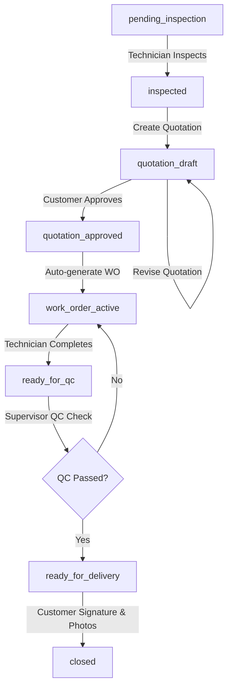

# Mamun Automobiles ERP — Workflows Documentation

This document describes the state machine, transitions, and Quality Control (QC) checkpoints of the automotive repair execution lifecycle.

---

## 1. Core Workflow Stages

The platform utilizes a dynamic workflow engine mapped across the following sequential operational phases:

### Stage Definitions

1. **`pending_inspection`**: Vehicle reception intake completed. Awaits detailed visual/mechanical inspection.
2. **`inspected`**: Diagnostic finding complete. Product and labor service requirements recorded.
3. **`quotation_draft`**: Estimated invoice quotation prepared. Versioning initialized at `v1`.
4. **`quotation_approved`**: Final sign-off logged by the customer (supports full or partial approvals).
5. **`work_order_active`**: Decomposed repair tasks are assigned to technicians and workshop bays.
6. **`ready_for_qc`**: All repair tasks completed. Ready for supervisor inspection.
7. **`ready_for_delivery`**: Quality assurance passes and road-tested successfully. Handover-ready.
8. **`closed`**: Recipient signature logged, delivery photos stored, and final invoice generated.

---

## 2. Dynamic Workflow Transitions

Transition configurations are registered in `workflow_transitions` and verified against roles and policies:

- **Managers**: Authorized to transition draft quotations to `sent` and `approved`.
- **Supervisors**: Authorized to verify repair completions and submit `quality_control` forms.
- **Receptionists**: Authorized to perform visual handovers and record delivery confirmations.
